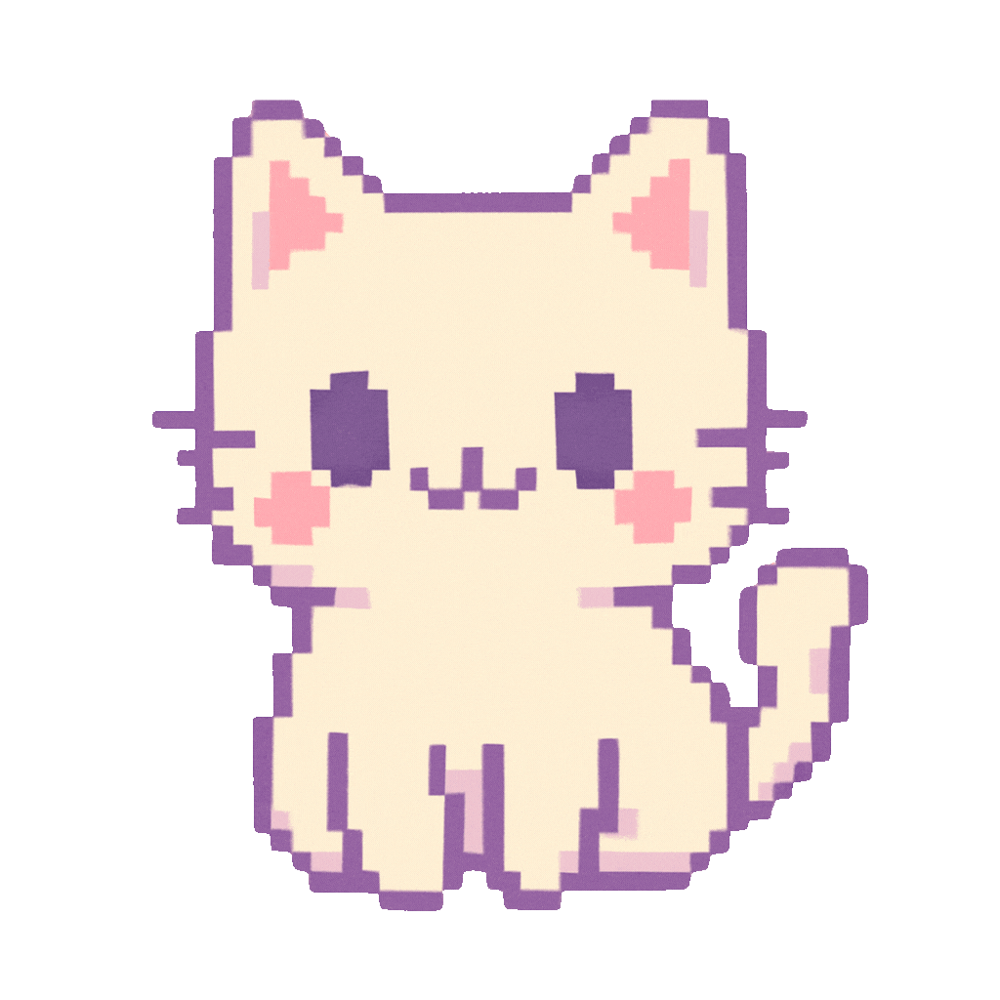
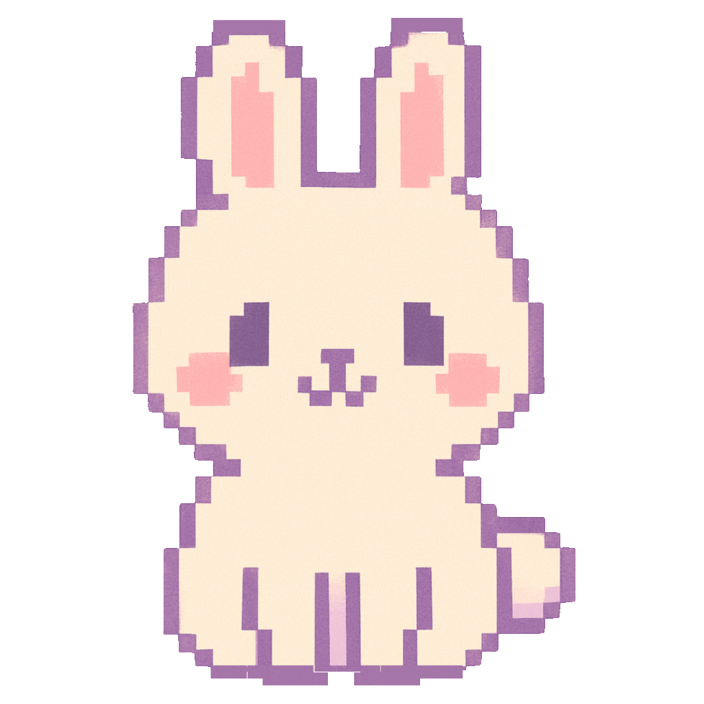

<div align="center">
  
  <h1>🐱 Jogo da Velha: Gato vs Coelho 🐰</h1>
  <p>
    
    <span style="margin: 0 20px; font-size: 24px; vertical-align: middle;">VS</span>
    
  </p>
</div>

## Índice
- [Sobre o Projeto](#sobre-o-projeto)
- [Como Jogar](#como-jogar)
- [Como Executar o Projeto](#como-executar-o-projeto)
- [Controles e Atalhos](#controles-e-atalhos)
- [Estrutura do Projeto](#estrutura-do-projeto)
- [Características e Funcionalidades](#características-e-funcionalidades)
- [Compatibilidade](#compatibilidade)
- [Acessibilidade](#acessibilidade)
- [Notas e Observações](#notas-e-observações)
- [Possíveis Melhorias Futuras](#possíveis-melhorias-futuras)
- [Licença](#licença)
- [Autor](#autor)

## Sobre o Projeto

Um jogo da velha kawaii (fofo) com tema de gato versus coelho! 
Desfrute de um design colorido, animações divertidas e efeitos visuais encantadores.

Este projeto foi desenvolvido usando HTML5, CSS3 e JavaScript puro, com foco em:
- Design visual atraente e temático
- Experiência de usuário agradável
- Responsividade completa para todas as telas
- Animações e efeitos visuais interativos

## Como Jogar

É simples! Você controla o gato 🐱 e joga contra o coelho 🐰 (controlado pelo computador).
Clique em qualquer célula vazia para fazer sua jogada. O primeiro a completar uma linha, 
coluna ou diagonal com seu símbolo vence!

### Recursos do jogo:
- Sistema de pontuação persistente (armazenado localmente)
- Efeitos visuais ao vencer (confetti e estrelas)
- Interface amigável e intuitiva
- Design responsivo para dispositivos móveis e desktop

## Como Executar o Projeto

Para uma experiência ideal com todas as imagens e recursos funcionando corretamente:

### Método Recomendado (usando Live Server):

1. Abra o projeto no Visual Studio Code
2. Instale a extensão "Live Server" (se ainda não estiver instalada)
   - Clique na guia de extensões (ou pressione `Ctrl+Shift+X`)
   - Pesquise por "Live Server"
   - Clique em "Instalar" na extensão desenvolvida por Ritwick Dey
3. Clique com o botão direito no arquivo `index.html`
4. Selecione a opção "Open with Live Server"
5. O jogo será aberto automaticamente em seu navegador padrão

### Método Alternativo:

Se você não quiser usar o Live Server, também pode abrir o arquivo `fallback_solution.html` 
diretamente no navegador. Esta versão usa SVGs animados em vez de GIFs, permitindo o 
funcionamento sem um servidor web.

## Controles e Atalhos

- **Mouse/Touch**: Clique ou toque nas células para fazer suas jogadas
- **Teclado (Desktop)**: Pressione `Shift+R` para zerar o placar
- **Botões**: 
  - "Reiniciar" - Começa um novo jogo mantendo o placar
  - "Zerar Placar" - Redefine a pontuação de ambos os jogadores para zero
  - "Jogar Novamente" - Após o fim de um jogo, inicia uma nova partida

## Estrutura do Projeto

O projeto está organizado em uma estrutura clara e modular:

```
jogo-da-velha/
│
├── index.html              # Arquivo principal do jogo
├── fallback_solution.html  # Versão alternativa com SVGs
│
├── css/
│   ├── style.css           # Estilos principais e temas kawaii
│   └── responsive.css      # Estilos específicos para responsividade
│
├── js/
│   └── script.js           # Lógica do jogo e interatividade
│
├── images/
│   ├── cat.gif             # GIF animado do gato
│   ├── rabbit.gif          # GIF animado do coelho
│   └── favicon.svg         # Ícone da guia do navegador
│
└── README.md               # Documentação do projeto
```

## Características e Funcionalidades

<table>
  <tr>
    <td width="50%" valign="top">
      <h3>Design e Experiência</h3>
      <ul>
        <li><b>Estilo Kawaii</b>: Design fofo e colorido inspirado na estética japonesa</li>
        <li><b>Elementos Visuais</b>: Cores pastéis, bordas pixeladas e animações suaves</li>
        <li><b>Personagens</b>: Gato e coelho animados como jogadores</li>
        <li><b>Efeitos Especiais</b>: Confetti e estrelas cintilantes na tela de vitória</li>
      </ul>
    </td>
    <td width="50%" valign="top">
      <h3>Funcionalidades Técnicas</h3>
      <ul>
        <li><b>Responsividade Total</b>: Adapta-se perfeitamente a qualquer tamanho de tela</li>
        <li><b>Suporte Multi-Touch</b>: Otimizado para dispositivos com tela sensível ao toque</li>
        <li><b>Modos de Orientação</b>: Visualização otimizada em modo retrato e paisagem</li>
        <li><b>Armazenamento Local</b>: Sistema de pontuação persistente usando localStorage</li>
        <li><b>IA do Jogo</b>: Algoritmo básico para as jogadas do computador</li>
      </ul>
    </td>
  </tr>
</table>

## Compatibilidade

O jogo foi testado e é compatível com:

| Dispositivo | Navegadores | Orientação |
|-------------|-------------|------------|
| Smartphones | Chrome, Safari, Firefox | Retrato e Paisagem |
| Tablets | Chrome, Safari, Firefox, Edge | Retrato e Paisagem |
| Desktops/Notebooks | Chrome, Firefox, Safari, Edge | - |

## Acessibilidade
- Cores com bom contraste para melhor legibilidade
- Elementos de tamanho adequado para interação
- Feedback visual claro para ações do usuário

## Notas e Observações

- **Servidor Web**: As imagens GIF funcionam melhor quando servidas por um servidor web como o Live Server
- **Atalhos**: Use `Shift+R` como atalho para zerar o placar (apenas em desktops)
- **Dados Salvos**: O placar é armazenado localmente no seu navegador
- **Privacidade**: Nenhum dado é enviado para servidores externos

## Possíveis Melhorias Futuras

- [ ] Modo multijogador local (dois jogadores humanos)
- [ ] Diferentes níveis de dificuldade para a IA
- [ ] Opções de personalização (temas de cores alternativos)
- [ ] Som e efeitos sonoros (opcional)
- [ ] Estatísticas de jogo mais detalhadas

## Licença

Este projeto é distribuído sob a [licença MIT](LICENSE). Sinta-se livre para usar, modificar e distribuir conforme as regras da licença.

```
MIT License

Copyright (c) 2025 Regiane Cabral

Permission is hereby granted, free of charge, to any person obtaining a copy
of this software and associated documentation files...
```

Veja o arquivo [LICENSE](LICENSE) completo para mais detalhes.

## Autor

Desenvolvido com 💖 e criatividade por Regiane Cabral.

---

<div align="center">
  <p>Obrigado por jogar! 🎮</p>
  
</div>
